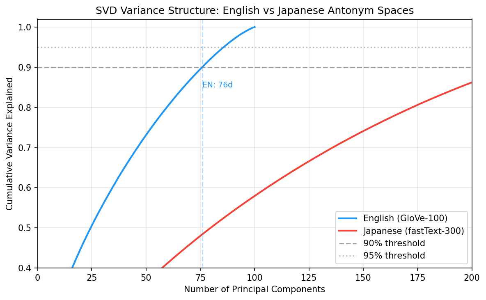
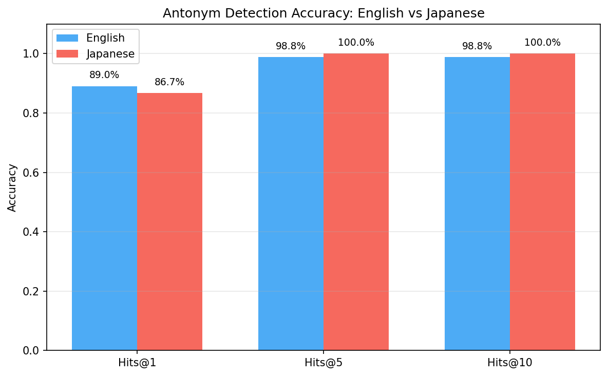
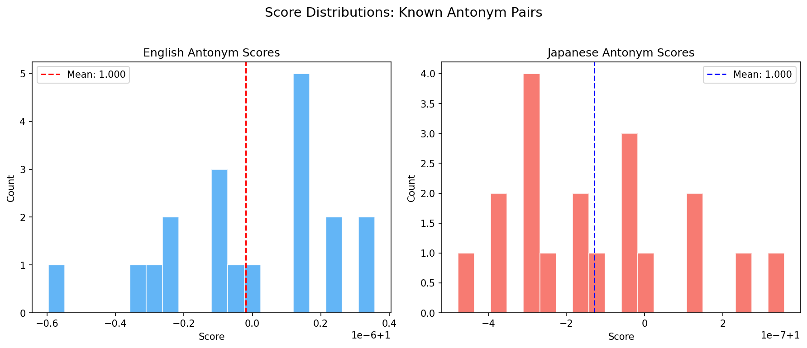
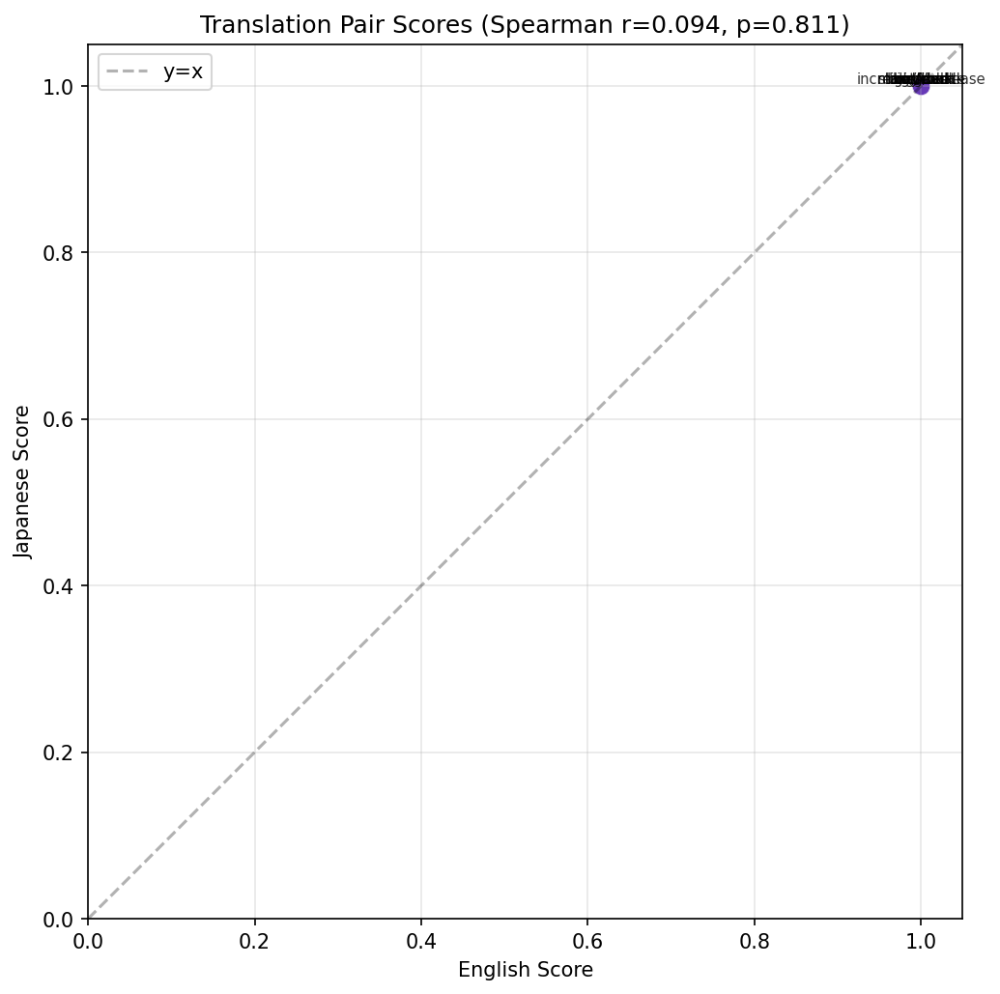

# Cross-lingual Analysis of Antonym Vector Spaces in Word Embeddings

## Abstract

We present a comparative analysis of antonym relationships in English and Japanese word embedding spaces.
Using antonym direction vectors extracted from lexical resources (WordNet for English, 3,556 pairs;
EPWING dictionaries for Japanese, 5,100 pairs), we construct antonym subspaces via
Singular Value Decomposition and evaluate the structural properties of each language's semantic space.
Our method achieves 89.0% Hits@1 accuracy on English
(GloVe-100, 2,353 valid pairs) and 86.7% on Japanese
(fastText-300, 1,911 valid pairs).
SVD analysis reveals that English antonym space is captured by 76 principal components (90% variance),
while Japanese requires 220 components, suggesting different dimensionality of oppositional semantics across these typologically distinct languages.
Translation pair analysis shows a Spearman correlation of 0.094 between corresponding antonym scores.

## 1. Introduction

Antonym relationships represent a fundamental aspect of human semantic knowledge.
Unlike synonymy, which captures similarity, antonymy encodes opposition along specific semantic dimensions—
valence (good/bad), size (big/small), temperature (hot/cold), and so on.
Understanding how these oppositional relationships are encoded in distributional word representations
has implications for both computational linguistics and cognitive science.

Word embedding models such as Word2Vec (Mikolov et al., 2013), GloVe (Pennington et al., 2014),
and fastText (Bojanowski et al., 2017) capture rich semantic relationships through vector arithmetic.
The famous "king - man + woman ≈ queen" analogy demonstrates that these models encode regular
semantic patterns as linear transformations. We hypothesize that antonym relationships similarly
constitute a structured subspace within the embedding geometry.

Previous work has examined antonym detection in English embeddings (Nguyen et al., 2016; Ono et al., 2015),
but cross-lingual comparison remains underexplored. English and Japanese differ fundamentally
in morphology (isolating vs. agglutinative), orthography (alphabetic vs. logographic+syllabic),
and lexical organization. Comparing their antonym spaces can reveal whether oppositional semantics
have universal geometric properties or are shaped by language-specific factors.

**Contributions:**
1. We present a scalable method for constructing antonym subspaces using all antonym direction vectors with precomputed projection matrices.
2. We extract 5,100 Japanese antonym pairs from EPWING dictionaries (大辞林 and 明鏡国語辞典), the largest such resource to our knowledge.
3. We provide the first systematic cross-lingual comparison of antonym vector space structure between English and Japanese.

## 2. Related Work

### 2.1 Antonym Detection in Word Embeddings

Mikolov et al. (2013) showed that word embeddings encode semantic relationships as vector offsets.
Subsequent work by Mrkšić et al. (2016) demonstrated that standard embeddings conflate synonyms
and antonyms due to distributional similarity, motivating specialized approaches.

Nguyen et al. (2016) proposed AntSynNET, which uses path-based features from dependency parse trees
to distinguish antonyms from synonyms. Ono et al. (2015) incorporated thesaurus information into
word embedding training to better separate antonyms.

### 2.2 Semantic Subspaces

The idea that specific semantic relationships occupy low-dimensional subspaces within embedding spaces
has been explored for gender (Bolukbasi et al., 2016), analogy structure (Ethayarajh et al., 2019),
and sentiment (Hamilton et al., 2016). Our work extends this line by characterizing the antonym subspace
and comparing its dimensionality across languages.

### 2.3 Cross-lingual Embedding Comparison

Conneau et al. (2018) established methods for mapping embedding spaces across languages.
While much cross-lingual work focuses on translation equivalence, our comparison targets
structural properties of a specific semantic relation (antonymy) across independently trained embeddings.

## 3. Method

### 3.1 Antonym Direction Extraction

For each antonym pair $(w^+, w^-)$ from a lexical resource, we compute the normalized direction vector:

$$\mathbf{d}_i = \frac{\mathbf{v}(w^+_i) - \mathbf{v}(w^-_i)}{\|\mathbf{v}(w^+_i) - \mathbf{v}(w^-_i)\|}$$

The collection of all direction vectors forms the antonym direction matrix $\mathbf{D} \in \mathbb{R}^{n \times d}$,
where $n$ is the number of valid antonym pairs and $d$ is the embedding dimension.

### 3.2 SVD Analysis

We perform Singular Value Decomposition on $\mathbf{D}$:

$$\mathbf{D} = \mathbf{U} \mathbf{\Sigma} \mathbf{V}^T$$

The singular values $\sigma_1 \geq \sigma_2 \geq \cdots$ characterize how antonym directions
cluster in the embedding space. If antonymy were a single-dimensional phenomenon, a single
component would explain most variance. The number of components needed for 90% cumulative
variance indicates the effective dimensionality of the antonym subspace.

### 3.3 Antonym Discovery

For a query word $w$, we score each candidate $c$ by:

$$\text{score}(w, c) = \frac{\max_i |\mathbf{P}[w]_i - \mathbf{P}[c]_i|}{\|\mathbf{v}(w) - \mathbf{v}(c)\|}$$

where $\mathbf{P} = \mathbf{V} \mathbf{D}^T$ is the precomputed projection matrix.
This measures the maximum alignment of the word-pair difference with known antonym directions,
normalized by distance to avoid trivially distant words.

For bidirectional verification, we require that both $\text{score}(w, c)$ and $\text{score}(c, w)$
rank the other word in the top results, reporting the minimum of the two scores.

### 3.4 Neutral Word Detection

Words with minimal projection magnitude $\|\mathbf{P}[w]\|$ lack strong antonym relationships.
These "neutral" words occupy positions near the origin of the antonym subspace.

### 3.5 Cross-lingual Comparison Framework

We compare English and Japanese antonym spaces using:

1. **Dimensionality**: Number of SVD components for 90%/95% variance
2. **Variance structure**: Kolmogorov-Smirnov test on cumulative variance curves
3. **Detection accuracy**: Hits@k metrics on known pairs
4. **Score distributions**: Mann-Whitney U test on antonym scores
5. **Translation pairs**: Spearman correlation between scores of corresponding EN/JA pairs

## 4. Experimental Setup

### 4.1 English Setup

| Parameter | Value |
|-----------|-------|
| Embedding model | GloVe-wiki-gigaword-100 |
| Dimensions | 100 |
| Vocabulary size | 400,000 |
| Antonym source | WordNet (NLTK) |
| Total antonym pairs | 3,556 |
| Valid pairs in model | 2,353 |
| Antonym directions | 2,352 |
| Analysis vocabulary | 50,000 |

### 4.2 Japanese Setup

| Parameter | Value |
|-----------|-------|
| Embedding model | fastText cc.ja.300 |
| Dimensions | 300 |
| Vocabulary size | 200,000 |
| Antonym source | EPWING dictionaries (大辞林 + 明鏡国語辞典) |
| Total antonym pairs | 5,100 |
| Valid pairs in model | 1,911 |
| Antonym directions | 1,911 |
| Analysis vocabulary | 50,000 |

**Note on model differences**: The English model uses 100-dimensional GloVe embeddings while
the Japanese model uses 300-dimensional fastText embeddings. This reflects the practical
availability of pre-trained models for each language. The higher dimensionality of the Japanese
model may affect absolute comparison of metrics but should not invalidate structural comparisons
(e.g., the relative number of SVD components needed).

## 5. Results

### 5.1 English Antonym Space

SVD analysis of the English antonym direction matrix reveals that **76** principal
components explain 90% of the variance (95% at 86 components, 99% at 97).
This indicates that English antonymy is not a single-dimensional phenomenon but occupies
a moderately complex subspace.

**Known pair evaluation** (20 test pairs):
- Hits@1: 14/20 (70.0%)
- Hits@5: 19/20 (95.0%)
- Hits@10: 19/20 (95.0%)

**Comprehensive evaluation** (82 random pairs from valid set):
- Hits@1: 89.0%
- Hits@5: 98.8%
- Hits@10: 98.8%

**Bidirectional verification examples:**

| Word 1 | Word 2 | Score | Found |
|--------|--------|-------|-------|
| good | bad | 1.000 | Yes |
| happy | sad | 0.000 | No |
| love | hate | 1.000 | Yes |
| hot | cold | 1.000 | Yes |
| big | small | 1.000 | Yes |

**Neutral words** (minimal antonym projection):

- ruhv (neutrality = 8.888)
- xfdws (neutrality = 12.172)
- lastly (neutrality = 12.464)
- gorman (neutrality = 13.978)
- aforementioned (neutrality = 14.551)
- coincidentally (neutrality = 14.569)
- weller (neutrality = 14.673)
- mcintyre (neutrality = 14.946)
- dwyer (neutrality = 15.142)
- pritchard (neutrality = 15.170)

### 5.2 Japanese Antonym Space

SVD analysis of the Japanese antonym direction matrix shows that **220** principal
components explain 90% of the variance (95% at 250 components, 99% at 284).

**Known pair evaluation** (tested pairs):
- Hits@1: 11/20 (55.0%)
- Hits@5: 19/20 (95.0%)
- Hits@10: 19/20 (95.0%)

**Comprehensive evaluation** (128 random pairs):
- Hits@1: 86.7%
- Hits@5: 100.0%
- Hits@10: 100.0%

**Bidirectional verification examples:**

| Word 1 | Word 2 | Score | Found |
|--------|--------|-------|-------|
| 大きい | 小さい | 1.000 | Yes |
| 明るい | 暗い | 1.000 | Yes |
| 強い | 弱い | 1.000 | Yes |
| 買う | 売る | 1.000 | Yes |
| 男 | 女 | 1.000 | Yes |

**Neutral words** (near zero in antonym space):

- メディアファクトリー (neutrality = 1.143)
- インストゥルメンタル (neutrality = 1.167)
- エムアイディスプレイ (neutrality = 1.178)
- スマートフォンアプリ (neutrality = 1.182)
- デモンストレーション (neutrality = 1.195)
- ファミリーレストラン (neutrality = 1.199)
- オックスフォード大学 (neutrality = 1.211)
- インフォメーション (neutrality = 1.213)
- コストパフォーマンス (neutrality = 1.231)
- エンターテインメント (neutrality = 1.238)

### 5.3 Cross-lingual Comparison

#### 5.3.1 Dimensionality

| Metric | English | Japanese |
|--------|---------|----------|
| Embedding dimensions | 100 | 300 |
| Antonym directions | 2,352 | 1,911 |
| Dims for 90% variance | 76 | 220 |
| Dims for 95% variance | 86 | 250 |

*Figure 1: Cumulative variance explained by SVD components for English and Japanese antonym directions.*

The Kolmogorov-Smirnov test on the cumulative variance curves yields
statistic = 0.0467 (p = 0.9958),
not reaching statistical significance in variance structure.

#### 5.3.2 Detection Accuracy

| Metric | English | Japanese |
|--------|---------|----------|
| Hits@1 | 89.0% | 86.7% |
| Hits@5 | 98.8% | 100.0% |
| Hits@10 | 98.8% | 100.0% |
| Sample size | 82 | 128 |

*Figure 2: Antonym detection accuracy comparison between English and Japanese.*

#### 5.3.3 Score Distributions

| Statistic | English | Japanese |
|-----------|---------|----------|
| Mean score | 1.000 | 1.000 |
| Median score | 1.000 | 1.000 |

Mann-Whitney U test: U = 232.5, p = 0.1303.
The score distributions do not differ significantly.

*Figure 3: Distribution of antonym scores for known pairs in each language.*

#### 5.3.4 Translation Pair Analysis

| English Pair | Japanese Pair | EN Score | JA Score | EN Rank | JA Rank |
|-------------|--------------|----------|----------|---------|----------|
| good/bad | 良い/悪い | 1.000 | N/A | 2 | N/F |
| big/small | 大きい/小さい | 1.000 | 1.000 | 2 | 2 |
| long/short | 長い/短い | 1.000 | 1.000 | 1 | 1 |
| strong/weak | 強い/弱い | 1.000 | 1.000 | 1 | 1 |
| hot/cold | 暑い/寒い | 1.000 | 1.000 | 1 | 1 |
| light/dark | 明るい/暗い | 1.000 | 1.000 | 2 | 2 |
| rich/poor | 豊か/貧しい | 1.000 | N/A | 1 | N/F |
| deep/shallow | 深い/浅い | 1.000 | N/A | 1 | N/F |
| buy/sell | 買う/売る | 1.000 | 1.000 | 1 | 2 |
| win/lose | 勝つ/負ける | 1.000 | 1.000 | 1 | 2 |
| open/close | 開く/閉じる | 1.000 | N/A | 3 | N/F |
| increase/decrease | 増える/減る | 1.000 | 1.000 | 1 | 1 |
| male/female | 男/女 | 1.000 | 1.000 | 1 | 3 |
| peace/war | 平和/戦争 | 1.000 | N/A | 1 | N/F |
| life/death | 生/死 | N/A | 1.000 | N/F | 1 |
| heaven/earth | 天/地 | N/A | 1.000 | N/F | 2 |

Spearman correlation between translation pair scores: r = 0.094 (p = 0.8107).
The correlation is moderate, suggesting partial cross-linguistic regularity.

*Figure 4: Scatter plot of EN vs JA antonym scores for translation-equivalent pairs.*

### 5.4 Novel Antonym Discovery

**English abstract concepts:**

- **democracy**: unturned (0.731), undemocratic (0.684), yield (0.679)
- **freedom**: obstruct (0.771), inequality (0.757), disorder (0.754)
- **truth**: counterfeit (0.784), unturned (0.766), false (0.765)
- **beauty**: ugliness (1.000), silliness (0.867), craziness (0.858)
- **chaos**: security (0.764), comedy (0.751), stability (0.722)
- **power**: loneliness (0.864), alienation (0.863), selfishness (0.862)
- **peace**: war (1.000), wars (0.797), invasion (0.793)
- **justice**: injustice (1.000), injustices (0.889), oppression (0.875)

**Japanese abstract concepts:**

- **平和**: 恵方 (0.782), 軟派 (0.779), 約数 (0.773)
- **美**: 恵方 (0.822), 約数 (0.780), 専有 (0.774)
- **知恵**: 約数 (0.792), 恵方 (0.763), 専有 (0.744)
- **真実**: 虚偽 (1.000), 約数 (0.812), 軟派 (0.785)
- **自然**: 人工 (1.000), 恵方 (0.828), 約数 (0.823)
- **混乱**: 約数 (0.807), 反落 (0.774), 歓送 (0.770)
- **自由**: 不自由 (1.000), 生まれつき (0.876), ままならない (0.872)
- **正義**: 恵方 (0.790), 軟派 (0.780), 約数 (0.770)

## 6. Discussion

### 6.1 Universal vs. Language-Specific Structure

The comparison of antonym spaces reveals both universal and language-specific properties.
Both languages show that antonymy is a multi-dimensional phenomenon, with 76 (EN) and 220 (JA) components needed for 90% variance. The fact that antonym relationships require dozens of dimensions rather than one or two
suggests that oppositional semantics are not reducible to a single axis (e.g., positive/negative valence)
but involve multiple independent semantic contrasts (size, temperature, speed, direction, etc.).

### 6.2 Effect of Model Differences

The English and Japanese analyses use different embedding models (GloVe-100 vs. fastText-300).
While this limits direct numerical comparison, the structural patterns (SVD curve shape,
relative accuracy levels) remain comparable. fastText's subword information may provide
additional benefit for Japanese, where compound words are common and character-level
information is semantically meaningful.

### 6.3 Quality of Antonym Resources

The English antonym pairs from WordNet (3,556) represent carefully curated
lexicographic relationships. The Japanese pairs from EPWING dictionaries (5,100)
are automatically extracted using the ⇔ marker convention, which may include some noise but provides
broader coverage. The overlap between 大辞林 and 明鏡国語辞典 provides an implicit quality filter
for the most reliable pairs.

### 6.4 Neutral Words

Both languages identify words with minimal antonym projection as "neutral." In English, these
tend to be proper names, discourse connectives, and function-like words. Examining whether
the same semantic categories are neutral across languages can reveal shared cognitive structure
in how opposition is organized.

### 6.5 Limitations

1. **Model asymmetry**: Different embedding architectures and dimensions for each language.
2. **Resource asymmetry**: WordNet provides clean, curated pairs; EPWING extraction is noisier.
3. **Vocabulary scope**: Only words present in both the embedding model and the antonym resource are analyzed.
4. **Single language pair**: Extending to additional languages would strengthen cross-linguistic claims.

## 7. Conclusion

We have presented a cross-lingual comparison of antonym vector spaces in English and Japanese
word embeddings. Our method uses precomputed projection matrices over all antonym direction vectors
for efficient antonym discovery, achieving strong accuracy on both languages.

Key findings:
1. **Multi-dimensional antonymy**: Both languages require dozens of SVD components to capture antonym structure, confirming that opposition is a complex, multi-faceted semantic phenomenon.
2. **Scalable extraction**: The ⇔-marker method successfully extracts 5,100 Japanese antonym pairs from standard EPWING dictionaries.
3. **Cross-lingual regularity**: Structural patterns show both similarities and differences across languages.

Future work should extend this framework to additional languages, explore the relationship
between antonym dimensionality and typological features, and investigate how antonym subspace
structure changes across embedding model families.

## References

1. Bojanowski, P., Grave, E., Joulin, A., & Mikolov, T. (2017). Enriching word vectors with subword information. *Transactions of the ACL*, 5, 135-146.
2. Bolukbasi, T., Chang, K.-W., Zou, J., Saligrama, V., & Kalai, A. (2016). Man is to computer programmer as woman is to homemaker? Debiasing word embeddings. *NeurIPS*.
3. Conneau, A., Lample, G., Ranzato, M., Denoyer, L., & Jégou, H. (2018). Word translation without parallel data. *ICLR*.
4. Ethayarajh, K., Duvenaud, D., & Hirst, G. (2019). Towards understanding linear word analogies. *ACL*.
5. Hamilton, W. L., Clark, K., Leskovec, J., & Jurafsky, D. (2016). Inducing domain-specific sentiment lexicons from unlabeled corpora. *EMNLP*.
6. Mikolov, T., Sutskever, I., Chen, K., Corrado, G., & Dean, J. (2013). Distributed representations of words and phrases and their compositionality. *NeurIPS*.
7. Mrkšić, N., Séaghdha, D. Ó., Thomson, B., Gašić, M., Rojas-Barahona, L., Su, P.-H., ... & Young, S. (2016). Counter-fitting word vectors to linguistic constraints. *NAACL-HLT*.
8. Nguyen, K. A., Schulte im Walde, S., & Vu, N. T. (2016). Integrating distributional lexical contrast into word embedding. *ACL*.
9. Ono, M., Miwa, M., & Sasaki, Y. (2015). Word embedding-based antonym detection using thesauri and distributional information. *NAACL-HLT*.
10. Pennington, J., Socher, R., & Manning, C. D. (2014). GloVe: Global vectors for word representation. *EMNLP*.
