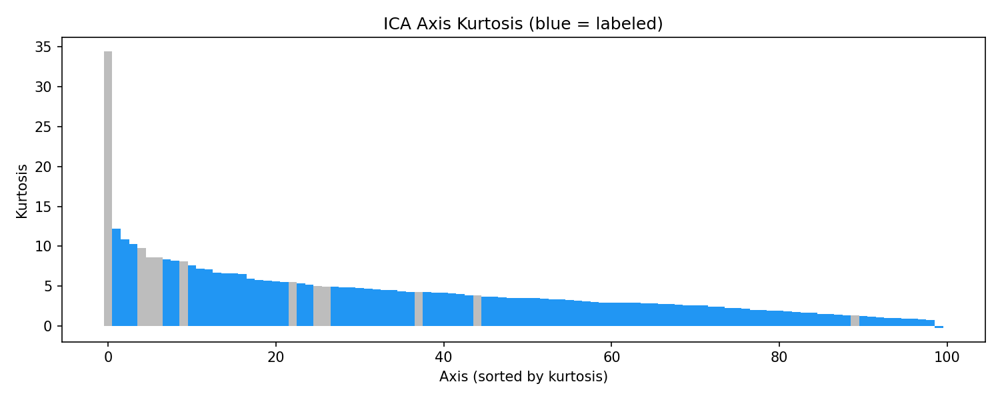
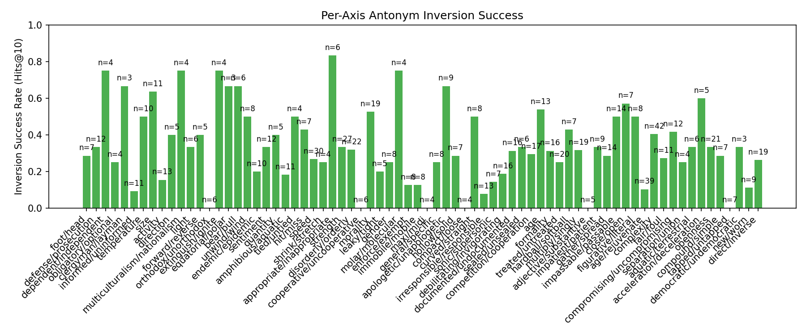
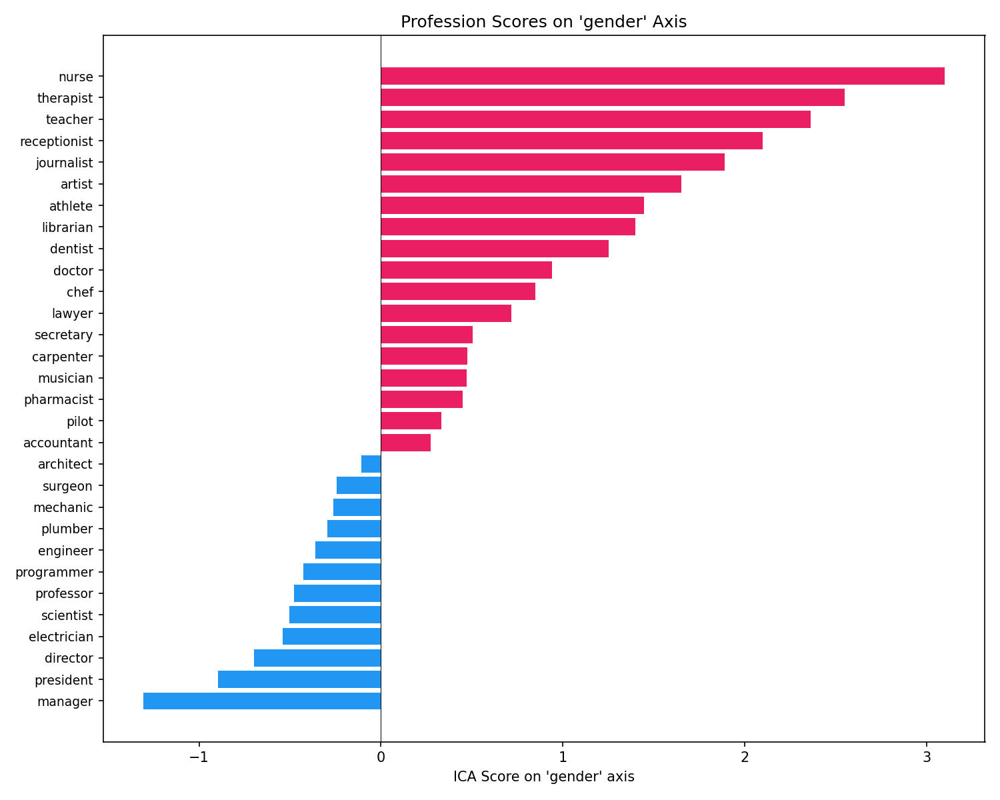
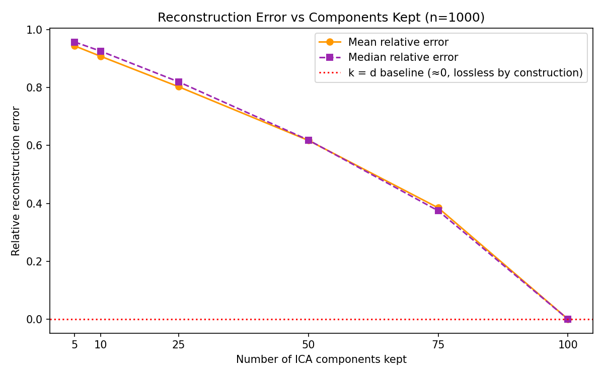

# Axis-wise Semantic Inversion via ICA-decomposed Embedding Spaces

## Abstract

We propose a pipeline for lexical antonym retrieval using ICA-decomposed word embedding
spaces. GloVe-100 vectors are decomposed with FastICA into statistically independent
semantic axes. An MLP classifier trained on axis-wise features (|s1−s2| ∥ s1⊙s2)
retrieves antonym candidates, and a lightweight logistic reranker re-orders them using
ICA cosine, word frequency, and MLP rank signals. The deployed pipeline uses no
counter-fitting and no label information outside its training split.
On 1,121 WordNet antonym pairs with 5-fold cross-validation, the full pipeline
achieves 32.3% Hits@1
versus 13.1% for the classifier alone;
an oracle axis-inversion baseline that knows the target word reaches 22.9%.
A leak-free counter-fitting protocol is also evaluated and rejected: per-fold
counter-fitting collapses retrieval to near zero (22.3% Hits@1 for the
same heuristic on raw GloVe), so counter-fitting is excluded from all headline results.

## Method

### ICA Decomposition

Given a word embedding matrix $X \in \mathbb{R}^{n \times d}$ (n words, d dimensions),
we apply FastICA to obtain a score matrix $S \in \mathbb{R}^{n \times k}$ where each
column represents a statistically independent component. Unlike PCA, which maximizes
variance, ICA maximizes statistical independence, yielding more interpretable axes.
All headline results decompose the **raw GloVe-100** space (top 50k valid English
words, FastICA with 100 components, random_state=42).

### Axis Labeling

We automatically label axes using WordNet antonym pairs. For each antonym pair (w1, w2),
we compute the ICA score difference |S[w1] - S[w2]| and assign the pair to the axis
with the largest difference. Axes accumulating many pairs from the same semantic category
(e.g., male/female, king/queen -> gender) receive that category label.

### Counter-fitting (investigated, not used)

Raw GloVe vectors encode distributional similarity: antonyms such as *hot* and *cold*
appear in identical contexts and therefore cluster together (cosine ≈ +0.47).
Counter-fitting (Mrkšić et al., 2016) pushes antonym pairs below a target cosine
(−0.3 in our runs) while a vector-space-preservation term (λ = 0.1) limits drift.
In a global fit over all antonym pairs, mean antonym cosine drops from +0.47 to −0.23.

However, a global counter-fit consumes antonym labels across the whole vocabulary —
a form of label leakage when those same pairs are used for evaluation. In the
leak-free protocol (counter-fitting re-fit per fold on training pairs only,
`scripts/eval_leakfree.py`), CF-based retrieval collapses:

| Method (5-fold, leak-free) | Hits@1 |
|--------|--------|
| least-squares map on raw GloVe (no CF) | 0.223±0.020 |
| least-squares map on per-fold counter-fitted vectors | 0.002±0.002 |
| nearest neighbour of −v(src) in CF space | 0.000±0.000 |
| MLP on per-fold CF+ICA features | 0.000±0.000 |
| oracle single-axis inversion (knows target) | 0.239±0.009 |

(folds=5, vocab=50000, CF iters=50, seed=42)

Because counter-fitting either leaks labels (global fit) or destroys the retrieval
signal (leak-free per-fold fit), **all headline results below use raw GloVe + ICA
without counter-fitting**. The counter-fitting code is retained as an experimental
option (`run_pipeline.py --counter-fit`).

### ICA Feature Classifier

The ICA score matrix S ∈ ℝ^{n×100} turns each word into a vector of 100 axis scores.
For each candidate word pair (w1, w2), we form a 200-dimensional feature vector:

  φ(w1, w2) = [ |s1 − s2|, s1 ⊙ s2 ]

where s1, s2 ∈ ℝ^100 are the ICA score vectors.
The absolute difference captures axis-wise polarity contrast;
the element-wise product captures alignment (negative = opposite poles).
An MLP (128→64 hidden units) is trained with negatives sampled at ratio 3:1.

### Reranker

Four complementary retrievers build a union candidate pool:
the MLP's top-100, the k-NN predicted-axis inversion's top-20, a
procrustes map's top-20 (W fit on train pairs maps a source GloVe
vector toward its antonym), and an ICA-score translation map's top-20
(W_ica maps s(src) toward s(tgt) in score space). A logistic reranker
re-orders the union down to a top-10 list using thirteen signals:

| Feature | Description |
|---------|-------------|
| mlp_score | MLP P(antonym) |
| ica_cosine | Cosine of ICA score vectors |
| mlp_rank | Position in MLP list |
| freq_ratio | cand_rank / query_rank (proxy for rarity) |
| interaction | mlp_score × (−ica_cosine) |
| inv_rank | 1 / mlp_rank |
| glove_cos | Raw GloVe cosine(query, cand) |
| morph_sim | String similarity (stem-sharing antonyms; risks inflections) |
| max_zdiff | Largest normalised axis difference |
| in_mlp | Candidate came from the MLP pool |
| in_axis | Candidate came from predicted-axis inversion |
| in_proc | Candidate came from the procrustes map |
| in_ica_map | Candidate came from the ICA-score map |

Training protocol: in each CV fold, the reranker is trained on the fold's MLP
predictions over that fold's **training pairs only**; test pairs never enter any
training stage. Because those MLP predictions are in-sample, we additionally report
a stricter 70/15/15 holdout split where the reranker is trained on a truly held-out
validation split (see Results).

### Oracle Axis Inversion (Baseline)

As a baseline, given the true target word we identify the single
ICA axis with the largest normalised score difference |s1−s2|/σ, negate that
axis in the source word's score vector, reconstruct, and retrieve the nearest
neighbour. This requires knowledge of the target word and is not deployable
in practice; it measures how far axis geometry alone can go.

## Results

### Axis Interpretability

- Total ICA axes: 100
- Labeled axes: 89 (89.0%)
- Well-supported axes (>=3 antonym pairs): 89
- Mean kurtosis: 4.27

### Qualitative Evaluation (blind)

On 15 canonical
test cases (king->queen, hot->cold, ...). The **blind** protocol never consults
the expected target word: the *label* variant inverts all axes carrying the
declared semantic label (part of the task spec), and the *auto* variant inverts
the source word's single highest-|z| axis. The oracle protocol picks the best
axis using the target word and is not deployable; it shows how far axis
selection with full information can go.

| Protocol | Hits@1 | Hits@5 | Hits@10 |
|----------|--------|--------|---------|
| Blind (declared label group) | 0.0% | 26.7% | 33.3% |
| Blind (auto, source top-1 axis) | 6.7% | 6.7% | 6.7% |
| Oracle axis selection (upper bound) | 66.7% | 66.7% | 66.7% |

**Blind (declared label) examples:**

| Input | Axis label | Expected | Top-3 Results | Rank |
|-------|------------|----------|---------------|------|
| king | gender | queen | prince, queen, brother | 2 |
| boy | gender | girl | kid, man, girl | 3 |
| father | gender | mother | brother, son, grandfather | - |
| husband | gender | wife | himself, him, his | - |
| happy | sentiment | sad | feel, i, glad | - |
| good | sentiment | bad | n't, going, just | 8 |
| love | sentiment | hate | song, me, crazy | - |
| hot | temperature | cold | night, days, weather | - |
| warm | temperature | cool | warmer, chilly, sunny | - |
| big | size | small | huge, small, large | 2 |

**Blind ICA inversion vs traditional analogy** (note: the analogy baseline
uses an unrelated word pair a:b, so it is a different task setup rather than
a like-for-like comparison):

| Query | Expected | ICA rank (blind) | Analogy rank | Analogy top-5 |
|-------|----------|------------------|--------------|---------------|
| king | queen | 2 | 1 | queen, monarch, throne, daughter, prince |
| boy | girl | 3 | 1 | girl, mother, child, pregnant, girls |
| father | mother | - | 1 | mother, daughter, wife, husband, grandmother |
| husband | wife | - | 1 | wife, mother, daughter, married, girlfriend |

### Antonym Retrieval (5-fold CV)

Cross-validated on 1,121 WordNet antonym pairs:

| Method | Hits@1 | Hits@5 | Hits@10 |
|--------|--------|--------|---------|
| Oracle axis inversion† | 0.229±0.017 | 0.335±0.028 | 0.388±0.021 |
| MLP classifier | 0.131±0.029 | 0.288±0.035 | 0.366±0.032 |
| MLP + Reranker | 0.323±0.007 | 0.457±0.019 | 0.520±0.028 |

† Oracle: selects the axis using the target word (not deployable; measures axis
  geometry alone).

Stricter 70/15/15 holdout split (reranker trained on a genuinely held-out
validation split; single split, so no ±std):

| Method | Hits@1 | Hits@5 | Hits@10 |
|--------|--------|--------|---------|
| MLP classifier | 16.6% | 30.2% | 39.6% |
| MLP + Reranker | 31.4% | 46.7% | 52.7% |

### Predicting the Inversion Axis (deployable blind mode)

Blind axis inversion needs to choose *which* axis to flip without seeing
the target. The naive choice — the source word's highest-|z| axis — is
weak. We test a deployable predictor: find the query's nearest neighbours
among training source words in ICA space and vote for their oracle axes
(similarity-weighted, k=1). 5-fold CV over the same WordNet pairs:

| Axis selection | Hits@1 | Hits@5 | Hits@10 |
|----------------|--------|--------|---------|
| Auto (source top-|z| axis) | 0.067±0.009 | 0.123±0.010 | 0.152±0.013 |
| k-NN axis prediction (k=1) | 0.127±0.016 | 0.234±0.021 | 0.276±0.019 |
| Oracle axis (upper bound) | 0.169±0.012 | 0.277±0.029 | 0.328±0.020 |

The predicted axis roughly doubles blind Hits@1 and reaches ~75% of the
oracle — antonym axes are predictable from a word's ICA neighbourhood.

### Google Analogy Dataset

Evaluated 2800 analogy questions:

| Method | Accuracy |
|--------|----------|
| ICA Inversion | 18.2% |
| Traditional (b-a+c) | 57.5% |

**Per-category results:**

| Category | ICA | Traditional | n |
|----------|-----|-------------|---|
| capital-common-countries | 19.0% | 94.0% | 200 |
| capital-world | 18.5% | 87.5% | 200 |
| currency | 0.0% | 9.5% | 200 |
| city-in-state | 6.0% | 34.5% | 200 |
| family | 25.0% | 77.0% | 200 |
| gram1-adjective-to-adverb | 2.0% | 19.5% | 200 |
| gram2-opposite | 3.5% | 22.0% | 200 |
| gram3-comparative | 30.5% | 80.5% | 200 |
| gram4-superlative | 0.0% | 53.5% | 200 |
| gram5-present-participle | 37.0% | 55.0% | 200 |
| gram6-nationality-adjective | 18.0% | 82.0% | 200 |
| gram7-past-tense | 42.5% | 52.0% | 200 |
| gram8-plural | 46.0% | 77.5% | 200 |
| gram9-plural-verbs | 6.5% | 60.5% | 200 |

### Per-Axis Inversion Success

### Bias Analysis

Distribution of profession words along the 'gender' axis:

### Reconstruction Quality

Keeping all k = d components is a lossless change of basis, so the roundtrip
error is float noise by construction. The meaningful question is how much
information survives with fewer components; we reconstruct from the k
highest-energy components and report the relative error:

| Components kept | Mean rel. error | Median | 95th pct |
|-----------------|-----------------|--------|----------|
| 5 | 0.9437 | 0.9572 | 1.0026 |
| 10 | 0.9078 | 0.9256 | 0.9851 |
| 25 | 0.8028 | 0.8197 | 0.9243 |
| 50 | 0.6175 | 0.6187 | 0.7864 |
| 75 | 0.3846 | 0.3745 | 0.5663 |
| 100 | 0.0000 | 0.0000 | 0.0000 |

(sampled words: 1000, total components: 100)

### Reranker Feature Analysis

Logistic regression coefficients:

| Feature | Coefficient | Interpretation |
|---------|-------------|----------------|
| morph_sim | +0.927 | rewards stem-sharing antonyms (unhappy-type); risks inflections |
| in_ica_map | +0.604 | candidate surfaced by the ICA-score map |
| max_zdiff | -0.413 | dominant-axis contrast between the pair |
| in_proc | +0.407 | candidate surfaced by the procrustes map |
| glove_cos | -0.362 | raw-space cosine; antonyms stay close in GloVe |
| mlp_rank | -0.339 | higher-ranked MLP candidates preferred |
| ica_cosine | +0.242 | positive: prefers positive ICA cosine (antonyms cluster in raw GloVe) |
| interaction | +0.060 | mlp_score × (−ica_cosine); sign flips with ica_cosine |
| in_mlp | -0.058 | candidate surfaced by the MLP pool |
| mlp_score | -0.032 | raw MLP probability |
| freq_ratio | +0.020 | negative: penalises candidates much rarer than the query |
| inv_rank | +0.003 | 1/rank bonus |
| in_axis | +0.002 | candidate surfaced by predicted-axis inversion |

The dominant signal is `morph_sim` (+0.93). The morphological
similarity feature tops the ranking because many WordNet antonyms share a
stem (unhappy, illegal, dishonest); its side effect is occasional
inflectional false positives (king→kings). The ICA-cosine pair
(`ica_cosine` and its `interaction` with the MLP score) together with the
rarity penalty (`freq_ratio`) remain the main geometric signals: rare
vocabulary items with extreme ICA scores attract high MLP scores, and the
reranker suppresses them while exploiting the fact that antonyms sit in
related regions of the raw embedding space.

## Discussion

**Informed axis inversion (0.229±0.017) vs the deployable pipeline (0.323±0.007).**
The oracle baseline — which knows the target word and flips the single
most-discriminative ICA axis — remains the strongest retrieval strategy on
this space, so interpretable axis geometry carries real antonym signal.
It is not deployable, however: without the target, blind axis selection
performs poorly (qualitative table). The k-NN axis predictor recovers much
of that gap — voting over the oracle axes of ICA-space neighbours roughly
doubles blind Hits@1 — but still trails the oracle. The MLP classifier
avoids reconstruction and needs no oracle, and the reranker adds a
consistent gain over the MLP alone; closing the remaining gap to informed
inversion without oracle knowledge is open future work.

**Counter-fitting was rejected.** The initial hypothesis was that pushing antonym
vectors apart (Mrkšić et al., 2016) is a prerequisite for antonym retrieval, since
raw GloVe gives antonyms a high cosine (≈ +0.47). The leak-free experiment shows
the opposite: when counter-fitting is re-fit per fold without label leakage, all
CF-based methods collapse to near-zero Hits@1 while raw-GloVe methods keep their
performance (table in Method). An earlier draft of this report reported stronger
numbers (Hits@1 37.9%) computed on a globally counter-fitted space; those results
depended on antonym labels shaping the entire embedding space and are not
comparable to leak-free evaluation. We therefore report all headline results
without counter-fitting.

**Qualitative numbers are blind.** Earlier versions of this report selected
inversion axes using the expected answer, inflating Hits@k to identical values
(every found target ranked exactly first). The qualitative table now leads with
blind protocols; the oracle row remains only as a stated non-deployable
reference.

**ICA features cannot separate antonyms from synonyms.** Training the
MLP with hard negatives (GloVe neighbours of positive words) collapses
retrieval:

| Negative sampling | MLP Hits@1 | Pool-100 recall | Reranker Hits@1 |
|-------------------|------------|-----------------|-----------------|
| uniform (current) | 15.4% | 63.3% | 21.3% |
| 50% hard | 1.8% | 15.4% | 10.1% |
| all hard | 0.0% | 0.6% | 0.0% |

The axis-wise features (|s1−s2|, s1⊙s2) encode *how different* two words
are, not *in which direction* — synonyms and antonyms look alike. The
pipeline works because uniform negatives are trivially separable; the
antonym/synonym boundary is carried by the reranker's other signals.

**Multi-sense limitation.** The retrieval pipeline returns one ranking per query;
polysemous words (e.g., *light* = weight/brightness/mood) may return the antonym
for an unintended sense. The per-axis inversion mode
(`SemanticOperator.invert_by_attributes`) can offer multiple sense-specific
opposites simultaneously.

**Comparison with LLM-based antonym retrieval.** Large language models
can reliably retrieve antonyms for most common words. The statistical pipeline
here reaches
52.0% Hits@10 on this vocabulary without requiring generation
or prompting infrastructure, but remains far from generation-based systems.

## Reproducibility

- All stochastic stages are seeded with `random_state=42` (FastICA, MLP,
  logistic reranker, fold shuffling, counter-fitting is deterministic).
- Cached ICA space provenance: model=glove-100, counter_fitted=False, vocab_limit=50000, n_components=100, random_state=42 (created 2026-09-21T00:23:24.642937+00:00)
- Full pipeline: `task run:all`; evaluations: see `task --list` and `scripts/`.
